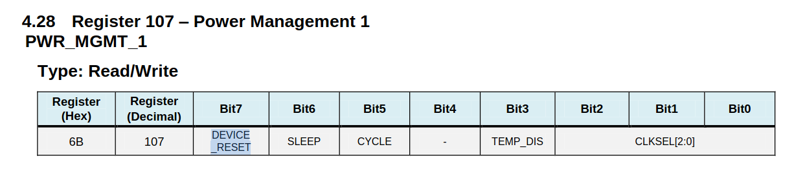

# exe 1

O código fornecido configura o registrador 0x6B:PWR_MGMT_1 colocando o valor 1 no bit 7:DEVICE_RESET, fazendo com que o dispositivo reinicie e opere com os valores de fábrica.

Agora, consultando o [manual](https://invensense.tdk.com/wp-content/uploads/2015/02/MPU-6000-Register-Map1.pdf), acesse o ACCEL_CONFIG e configure o acelerômetro para operar no range de 4G.
